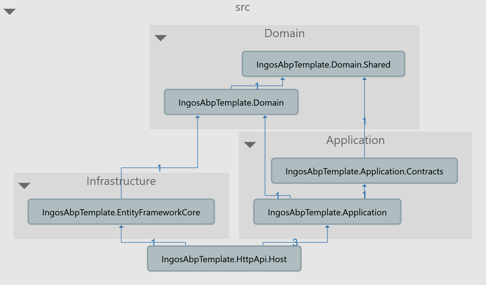
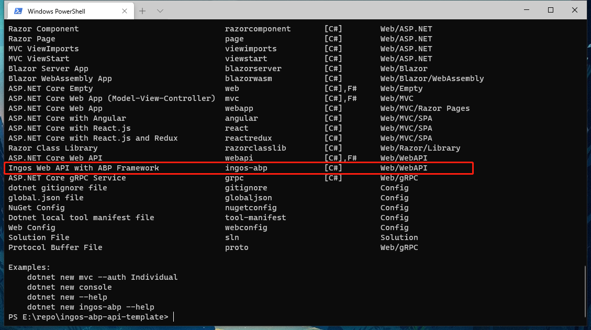
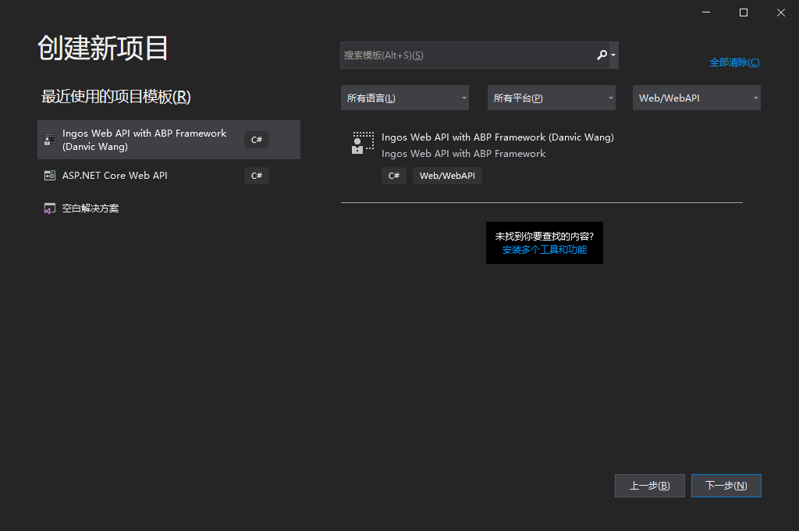

# ingos-abp-api-template
[English](./README.md) | 简体中文

这是一个集成了 dapr 的精简版 abp vnext web api 项目模板


## Architecture




## Get Started

### 1、加载模板

Similar to installing other dotnet tools, you can use `dotnet new`  command to install this template on your computer.

```sh
-- it will install this template in your computer
dotnet new -i Ingos.Abp.Templates
```

Also, if you want to install the specified version, you need to add the version no after the name of the template

```sh
-- it will install the 1.0.0 version of this template 
dotnet new -i Ingos.Abp.Templates::1.0.0
```

When you see the following picture, it means that the template has been installed successfully




### 2、如何使用

After you have installed this template, you can use dotnet cli to create a new project based on this template, just like the following shell.

```sh
-- it will create a project which named Sample 
dotnet new ingos-abp-api -n Sample
```

PS, please do not include special symbols in the project name

If you want to learn more about this template, you can enter the following shell script to get help information.

```shell
dotnet new ingos-abp-api --help
```

If you want to see the use case of this template, you can view this repository([ingos-configuration](https://github.com/danvic712/ingos-configuration))

Or you can using the latest Visual Studio to create the project, but please note that this cannot modify the default database option. The default database is MySQL.



When you create a new project, you need to change the connection string first, it located in the `appsetting.json` file

```json
{
  "ConnectionStrings": {
    "Default": "Server=Server Address;Port=3306;Database=Change_To_Your_Database_Here;Uid=root;Pwd=Change_To_Your_Password_Here"
  }
}
```

Locate the `*.Infrastructure` path in the console, and then you can execute the ef migrations command to restore framework built-in tables, wait for the command execution complete

```shell
-- create a new migration
dotnet ef migrations add Initialize

-- apply the changes
dotnet ef database update
```

Now you can run this project, wait for the browser to open automatically and then enjoy you development


### 3、卸载模板

```shell
-- it will uninstall this template from your computer
dotnet new -u Ingos.Abp.Templates
```


## 参考引用

If you want to find some related development documents, you can try from the link below

1. [Implementing domain driven design using abp template](https://docs.abp.io/en/abp/latest/Domain-Driven-Design)
2. [墨墨墨墨小宇's CnBlog Site(只包含中文版本)](https://www.cnblogs.com/danvic712/)

